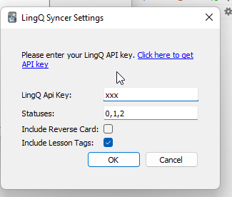
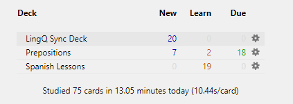
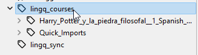

# LingQ Syncer
Sync LingQs on demand. 

**Features**

- Syncs lessons and courses into tags (allowing custom study of chapters)
- Does not overwrite already synced LingQs
- Sync available from Tools menu on demand
- Settings allow disabling reverse card, and custom import statuses

**Planned Features**
- Update LingQ from Anki deck after learned or mature
- Include language as tag

## Installing

### From the Anki Add-on Repository

In Anki, select `Tools` -> `Add-ons` -> `Get Add-ons` and then enter the code from the bottom of this addon's page: [Anki Addon Page](https://ankiweb.net/shared/info/98811431)

## Use

### Setup

After installing the addon, please be sure to restart Anki.

After restarting, you can now open the addons settings under the `Tools` -> `Add-ons` and access the main control pane by selecting the addon `LingQ Syncer` and then pressing the config button.

**You must insert the `LingQ API Key` or the addon will not work**

**Stauses:**
- 0 = New
- 1 = Recognized
- 2 = Familiar
- 3 = Learned

Statuses must be a comma list.

**Include Lesson Tags:**

Unselecting this option will not include LingQ lesson tags. Syncing will be a little faster.

### Syncing

To sync your deck, click `Tools` -> `Sync LingQ`

Syncs into seperate `LyncQ Sync Deck`:

*Cards will be tagged grouped by lesson and course (if setting is enabled)*

