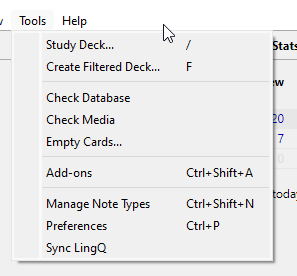

# LingQ Syncer
Sync LingQs on demand. 

**Features**

- Syncs lessons and courses into tags (allowing custom study of chapters)
- Does not overwrite already synced LingQs
- Sync available from Tools menu on demand
- Settings allow disabling reverse card, and custom import statuses

**Planned Features**
- Update LingQ from Anki deck after learned or mature
- Include language as tag

*Syncs into seperate "LyncQ Sync Deck"*

*Lesson tags appear grouped by courses and lessons*

## Installing

### From the Anki Add-on Repository

In Anki, select `Tools` -> `Add-ons` -> `Get Add-ons` and then enter the code from the bottom of this addon's 

## Use

### Setup

After installing the addon, please be sure to restart Anki.

After you can now open the addons manager under the `Tools` -> `Add-ons` and access the main control pane by selecting the addon `LingQ Syncer` and then pressing the config button.

Stauses:
- 0 = New
- 1 = Recognized
- 2 = Familiar
- 3 = Learned

### Syncing

To sync, click `Tools` -> `Sync LingQ`

